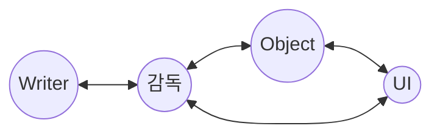

문서정보 : 2023.02.03.~ 작성, 작성자 [@SAgiKPJH](https://github.com/SAgiKPJH)

 

# [이름미정]
Unity C# or Unreal로 만든 3D게임 [이름미정]

### 목표

- [ ] 1. [이름미정] 개요
  - [ ] 개요
  - [ ] 요구사항
  - [ ] 요구사항 총족을 위한 기술적 내용
- [ ] 2. [이름미정] 설계
  - [ ] 개발 환경 설계
  - [ ] 개발 구조 설계
  - [ ] 개발 일정 구성
- [ ] PPT 제작
- [ ] 3. [이름미정] 기본 구축
- [ ] 4. [이름미정] 개발

### 제작자
[@SAgiKPJH](https://github.com/SAgiKPJH)

### 참조

- [참조링크](참조링크)

 

---

# 1. [이름미정] 프로그램 개요

## 1-1 개요

사람들에게는 직접 해보지 못하는 것들이 존재한다. 이를 매채 통해 대리만족을 하게 되는데 본인같은 경우에는 해군을 다녀오면서 함선을 직접 다루며 전쟁에서 활약해보는 내용을 꿈꾸었다.  
전투기도 직접 운전해보며 활약하고 싶지만, 다행이도 전투기는 게임이 잘 만들어져 있어 욕구를 총족해주지만, 함선의 경우 아직 크게 만족하는 내용이 없어 직접 만들고자 한다.  
또한 개발자의 역량을 강화하는데에도 목적이 있다.

 

## 1-2 요구사항

- 3D 게임이다.
- Git을 활용한 코드관리.
- 코드가 매우 직관성 있어야 한다.
- Ace Combat을 많이 참고할 것
- 현실적인 묘사가 필요하다.
  - 실사 오브젝트
  - 현실적인 감각을 지닌 게임성
  - 일부 함선의 매력을 느끼기 위해서 비현실적인 특징 부여 고려가능
- 해군에서 찍은 함선 사진 및 영상을 구현할 수 있어야 한다.
- 스토리가 존재하며, 클리어 형식이다. (AceCombat 형식)

 

## 1-3 요구사항 총족을 위한 기술적 내용

- 개발 툴 : 유니티(Unity)
- 품질관리를 위해 Test를 구성한다
- Git을 이용해 코드를 관리한다
- 직관적이고 알기쉬운 프로젝트 구성 및 코드를 구성한다.
  - 쉬운 유지보수, 인수인계를 위한 직관적인 코드 구조
- 최적화 고려
- 테스트 자동화

   

# 2. [이름미정] 설계

## 2-1 개발환경 설계

### 개발 언어
- C#

### 개발 툴
- Unity
- Visual Studio 2022

### Test
- xUnit
- FluentAssertion

 

## 2-2 구조 설계

- 감독(Director)
- 배우(Actor)
- UI
- User

  

## 2-3 프로젝트 관리 설계

### 관리 툴

- Git
- Git Hub
- Git Fork

### Git repository 구성
- / : README.md을 배치
- /Doc : [문서].md를 배치
- /WhyWay : 프로젝트 폴더
- /Presentation : PPT 등을 배치

### Git Branch 구성

- main : Release 배포, README.md 문서 (public)
- Develop : 개발 통합 (private)
- Feature(n) : 기능 구현 (private)
- Release : 배포용, 모든 개발 결과가 이곳에 저장 (private)
- Test : Test 공간 (private)

 

## 2-4 프로젝트 구조 설계

### 구조 적용
- 에디터 스크립트를 통해 적용한다.

### 구조 설계
- *Editor : 유니티에 포함된 에디터 기능을 확장하기 위한 스크립터 저장
- *Resorces : 게임 프로그램 외부 파일 로드 폴더
- *Plugins : 아이폰, 안드로이드등 플랫폼으로 동작할 때 필요한 네이티브 플러그인을 저장
- Asset
  - Art
    - Materials
    - Models
    - Textures
  - Animation
    - Animators
    - AnimationClips
  - Audio
    - Music
    - Sound
  - Code
    - Scripts
      - Director
      - Ator
      - UI
      - Common
      - Tests
    - Shaders
  - Docs
  - Level
    - Prefabs
    - Scenes
    - UI
- Logs
- Library
- Pakages
- Project Setting : Unity Project 설정 파일 포함된 폴더

### 참조

- [[Unity] 유니티 프로젝트를 구성하기 위한 방법](https://velog.io/@jaehyeoksong0/unity-organizing-your-project)
- [Projecr Structure (Unity Project 구조 및 모범 사례](https://drehzr.tistory.com/1306)
- [(Unity) 유니티 프로젝트 폴더구조](https://gnam.tistory.com/8)

 

# 2-5 일정 설계

### 6개월 (대략) (4W = 1M)
- (2W) 개요 작성                              (2023.02.02.~02.16.)
- (1M) 설계                                   (02.17.~03.17.)
- (1M) 개발                                   (03.18.~04.18.)
- (2W) 추가 설계                              (04.19.~05.03.)
- (2W) 추가 개발                              (05.04.~05.18.)
- (1M) Test 및 개선 (Detail 향상, 최적화 완료) (05.19.~06.19.)
- (2W) 최종 Test                              (06.20.~07.04.)
- (1M) 예비 일                                 (1M, 30d)
- (1W) 배포 준비 및 출시                       (08.05.~08.11.)

   

# 3. [] 기본 구축

## 3-1 기본 구축

### 프로젝트 구축
