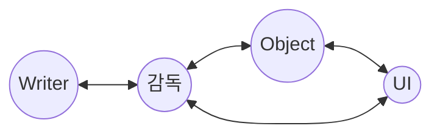

문서정보 : 2023.02.03.~ 작성, 작성자 [@SAgiKPJH](https://github.com/SAgiKPJH)

 

# [이름미정]
Unity C# or Unreal로 만든 3D게임 [이름미정]

### 목표

- [ ] 1. [이름미정] 개요
  - [ ] 개요
  - [ ] 요구사항
  - [ ] 요구사항 총족을 위한 기술적 내용
- [ ] 2. [이름미정] 설계
  - [ ] 개발 환경 설계
  - [ ] 개발 구조 설계
  - [ ] 개발 일정 구성
- [ ] 3. [이름미정] 기본 구축
- [ ] 4. [이름미정] 개발

### 제작자
[@SAgiKPJH](https://github.com/SAgiKPJH)

### 참조

- [참조링크](참조링크)

 

---

# 1. [이름미정] 프로그램 개요

## 1-1 개요

사람들에게는 직접 해보지 못하는 것들이 존재한다. 이를 매채 통해 대리만족을 하게 되는데 본인같은 경우에는 해군을 다녀오면서 함선을 직접 다루며 전쟁에서 활약해보는 내용을 꿈꾸었다.  
전투기도 직접 운전해보며 활약하고 싶지만, 다행이도 전투기는 게임이 잘 만들어져 있어 욕구를 총족해주지만, 함선의 경우 아직 크게 만족하는 내용이 없어 직접 만들고자 한다.  
또한 개발자의 역량을 강화하는데에도 목적이 있다.

 

## 1-2 요구사항

- Ace Combat을 많이 참고할 것
- 현실적인 묘사가 필요하다.
  - 실사 오브젝트
  - 현실적인 감각을 지닌 게임성
  - 일부 함선의 매력을 느끼기 위해서 비현실적인 특징 부여 고려가능
- 3D로 이루어진 게임
- 해군에서 찍은 함선 사진 및 영상을 구현할 수 있어야 한다.

 

## 1-3 요구사항 총족을 위한 기술적 내용

- 개발 툴 : 유니티(Unity)
- 품질관리를 위해 Test를 구성한다
- Git을 이용해 코드를 관리한다
- 직관적이고 알기쉬운 프로젝트 구성 및 코드를 구성한다.

   

# 2. [이름미정] 설계

## 2-1 개발환경 설계

### 개발 언어

- C#

 

### 개발 툴

- Visual Studio 2022

 

### Test

- xUnit
- FluentAssertion

  

## 2-2 구조 설계

- 감독(Director)
- 배우(Actor)
- UI
- User

  

## 2-3 프로젝트 관리 설계

### 관리 툴

- Git
- Git Hub
- Git Fork

### Git Branch

- main : Release 배포, README.md 문서
- develop
- ???
- Test

 

## 2-4 프로젝트 구조 설계

   

# 3. ArtistHelper 기본 구축

## 3-1 기본 구축

### 프로젝트 구축

- 프로젝트 생성
  - `WPF 앱(.NET Framework)` 프로젝트 생성 (.Net Framework 4.8)  
  
- 폴더 구축  
  - View 폴더 생성
  - ViewModel 폴더
  - Model 폴더
  - Interface 폴더
  - MainWindow.xaml 삭제  
  

  

## 3-2 DevExpess

- DevExpress 설치
  - [DevExpress 사이트](https://www.devexpress.com/products/net/controls/wpf/)
- DevExpress 참조 추가
  - DevExpress.Data.Desktop
  - DevExpress.Data
  - DevExpress.Mvvm
  - DevExpress.Xpf.Core
  - DevExpress.Xpf.Docking
  - DevExpress.Xpf.Layout.Core
  - DevExpress.Xpf.LayoutControl
  - DevExpress.Xpf.Ribbon  
    
  

  

## 3-3 MVVM

  

## 3-4 Test

   

# 4. ArtistHelper 개발
